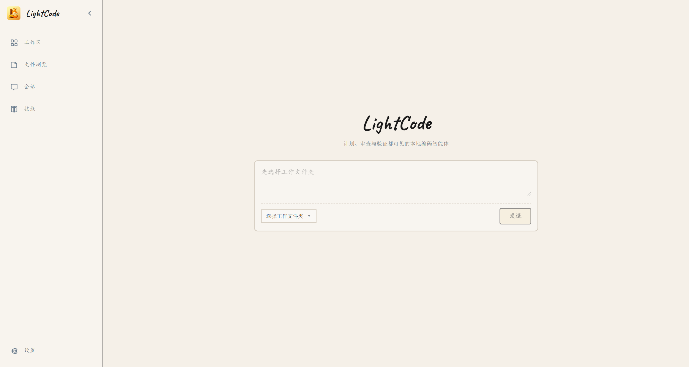
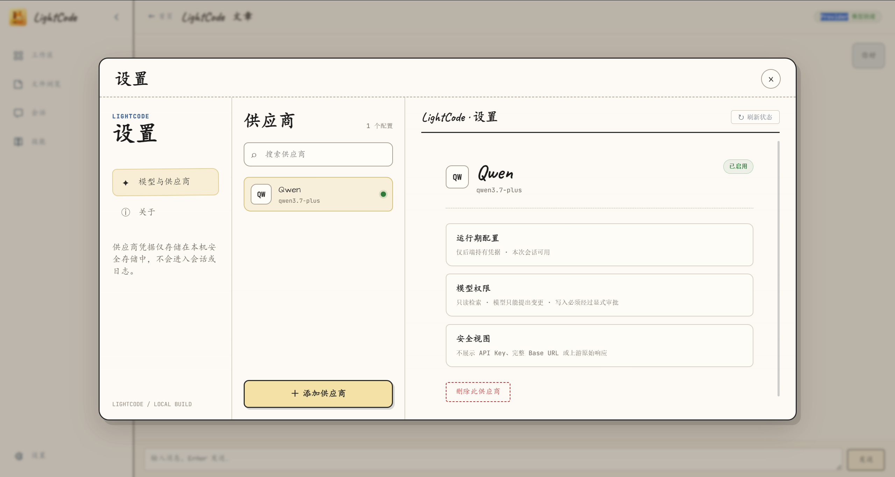
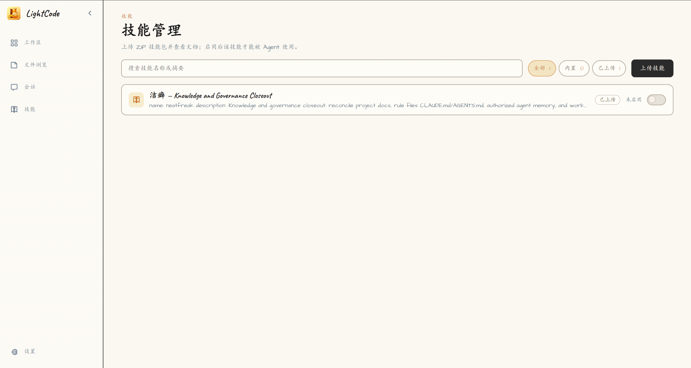

# LightCode

**本地优先、可视化、安全的 AI 编码智能体（AI Coding Agent）。AI 只提议，你审批后才改文件——计划、代码差异、审批与验证全程可见可追溯。Windows 桌面端 + Web 双形态，OpenAI 兼容多模型供应商，MIT 协议。**

它让 AI 帮你写代码的过程**看得见、控得住、可追溯**：AI 会先展示计划与代码差异，等你审批同意后才真正修改文件——AI 永远不能绕过你直接改动你的代码。

LightCode 是独立设计、独立实现的原创项目，不是任何现有编码智能体项目的分支或改名。

---

## 产品简介

大多数 AI 编程工具像「黑盒」：你输入需求，它直接改你的文件，中间发生了什么、改了什么、为什么这么改，你往往不知道。

LightCode 反其道而行之，把 AI 编程拆成一个个**你可以审查、批准、拒绝的步骤**：

1. 你向 AI 描述需求；
2. AI 读取你**已授权**的代码库，给出执行计划；
3. AI 生成具体的代码改动（差异），并说明改了哪些文件；
4. **你审查这份差异，决定批准还是拒绝**；
5. 批准的改动由系统安全地写入文件，并自动验证写入结果。

整个过程——计划、工具调用、代码差异、审批记录、验证结果——都以时间线的形式完整展示，随时可以追溯。


### 界面预览

| 工作区聊天式 Agent 主界面 | 模型与多供应商设置 | 技能（Skill）管理 |
|---|---|---|
|  |  |  |

- **工作区**：在已授权的本地代码库中与 AI 对话，AI 输出计划、代码差异与审批请求，右侧可查看文件上下文。
- **模型与供应商**：集中配置一个或多个 OpenAI 兼容的模型供应商，测试连接、查看安全摘要（不显示密钥与完整地址）。
- **技能（Skill）**：上传与管理 AI 技能包（SKILL.zip），按需启用、禁用，让 AI 获得针对性的领域能力。

---

## 核心亮点

- **可视化的编码智能体**：计划、工具活动、代码差异、审批与验证结果全程可见、可控、可追溯。
- **受控的真实文件能力**：支持在已注册的本地工作区内，对单个 UTF-8 文本文件执行「审批后原子替换」，并内置完整性验证。
- **多模型供应商**：支持任意 OpenAI 兼容的 Provider，可在设置界面随时添加、切换、测试。
- **聊天闭环**：自由问答与编辑任务自动分流——普通问答直接回答，涉及改代码的请求自动生成候选改动并请求审批。
- **技能管理**：支持 ZIP 技能包上传、校验、启用/禁用与删除，并配有 Agent 门禁。
- **双形态交付**：Web 开发模式 + Windows 桌面应用（Electron 安全外壳 + NSIS 安装器）。

---

## 技术架构

LightCode 采用单体仓库（Monorepo），由三部分组成，职责严格分离：

```text
┌─────────────────────────────────────────────────────────────┐
│  Electron 桌面外壳（仅 Windows）                              │
│  窗口生命周期 · sidecar 启动 · 原生文件夹选择 · 受限 IPC         │
└──────────────────────────────┬──────────────────────────────┘
                               │ REST + SSE
┌──────────────────────────────▼──────────────────────────────┐
│  FastAPI 后端（唯一的权威边界）                                │
│  工作区守卫 · 受控只读工具 · ChangeSet 生成 · 版本绑定审批       │
│  原子写入 · 模型编排 · 凭据存储 · 事件流（SSE）                  │
│  SQLite（本地持久化）                                         │
└──────────────────────────────┬──────────────────────────────┘
                               │ HTTP + SSE
┌──────────────────────────────▼──────────────────────────────┐
│  Vue 3 前端                                                  │
│  Home / Workspace / Task / Settings / Skills                │
│  不接触文件系统 · 不持有密钥                                   │
└─────────────────────────────────────────────────────────────┘
```

- **前端**（`frontend/`）：Vue 3 + TypeScript + Vite + Vue Router + Pinia。产品运行时只通过 HTTP/SSE 与后端通信，不直接访问文件系统、SQLite 或模型 Provider。
- **后端**（`backend/`）：FastAPI + SQLite。工作区注册、文件访问、模型出网、ChangeSet、审批与原子写入**全部在服务端完成**，是系统唯一的权威边界。
- **桌面端**（`electron/`）：Electron 只作为原生外壳与信任代理，渲染进程保持沙箱化（`contextIsolation` / `sandbox` / 禁用 `nodeIntegration`），唯一的桥接是「选择文件夹」这一窄接口。

---

## 安全设计

LightCode 的核心设计原则：**AI 永远不能未经你同意就修改你的代码。**

### 模型边界（只提议，不执行）

- 模型（默认关闭）只能**提议**：输出执行计划、请求受控的只读工具（读取文件、搜索代码），并生成候选改动；
- 模型**不能**写文件、执行命令、调用网络工具、管理包、写入 Git 或决定审批；（后续开发，当前只是初版）
- 发往模型的上下文不包含真实文件路径，只使用不透明的安全令牌（fileToken）。

### 审批写入协议

```text
已注册工作区
  → 受控只读工具（list / read / search）
  → 服务端生成并持久化 ChangeSet
  → 用户审批指定版本（changeSetId + revision + diffHash）
  → 写前基线校验（基线变化则拒绝，不覆盖外部改动）
  → 单文件原子替换
  → 内建完整性验证（UTF-8、SHA-256、diff 摘要核对）
  → 持久化事件与历史
```

- 审批绑定具体版本与哈希，过期或哈希不匹配的审批一律无效；
- 每次实际写入前重新校验路径策略、文件身份与当前哈希；
- 状态迁移、工具结果、审批与事件在写入 SQLite 事务成功后才对外可见。

### 凭据与隐私

- API Key 在 Web 开发期存于进程内存，桌面模式使用 Windows Credential Manager；
- 任何情况下密钥不进 SQLite、日志、SSE 事件或前端持久化；
- 日志与指标经统一出口脱敏（拒绝名单 + 敏感形状扫描），测试会断言日志不含密钥。

### 渲染进程与浏览器边界

- 浏览器/渲染进程只提交 `workspaceId`、会话标识、用户消息与审批决定，绝不提交文件路径、命令或密钥；
- 请求体经 `extra="forbid"` 严格校验，携带 `rootPath` / `filePath` / `patch` / `command` 字段的请求会被拒绝；
- 路径访问一律经服务端 `WorkspaceGuard` 守卫：拒绝路径遍历、符号链接逃逸、敏感文件（`.env`、`.git`、私钥等）与工作区外访问。

---

## 功能特性

- **工作区管理**：静态配置注册 + 桌面端动态注册（原生文件夹选择，可重复注册幂等处理）；
- **受控代码读取**：文件树浏览、文件预览、内容搜索，均使用不透明浏览令牌；
- **真实任务闭环**：计划 → 读取工作区 → 生成差异 → 审批 → 应用 → 验证，全程状态机驱动；
- **聊天会话**：会话持久化、自由问答与编辑任务自动分流、SSE 实时事件流；
- **模型与供应商**：多供应商 Profiles（增删改查）、最小化连接测试、安全摘要展示、fail-closed 配置；
- **技能管理**：ZIP 技能包上传与安全校验（大小/条目/敏感文件限制）、启用/禁用、删除；
- **可观测性**：JSON 结构化日志、关联 ID、进程内指标、预算/并发/故障门禁、敏感数据扫描；
- **桌面交付**：Windows NSIS 安装包、内置 sidecar 免环境依赖、用户数据存放于安装目录之外。

---

## 技术栈

| 层 | 技术 |
|---|---|
| 前端 | Vue 3、TypeScript、Vite、Vue Router、Pinia、Vitest |
| 后端 | Python 3.11+、FastAPI、SQLite、LangGraph、pytest |
| 模型 | OpenAI 兼容 Provider（OpenAI / DeepSeek / 本地 vLLM 等任意兼容实现） |
| 桌面 | Electron、PyInstaller（sidecar）、electron-builder + NSIS |
| 安全 | WorkspaceGuard、HMAC 浏览令牌、Windows Credential Manager、原子写入 |

---

## 快速开始（开发者）

### 环境要求

- Python 3.11 或更高版本
- Node.js 与 npm（前端 / 桌面端）
- Windows（桌面端交付目前仅支持 Windows）

### 1. 启动后端

```bash
cd backend
python -m venv .venv
# Windows:
.venv\Scripts\activate

uvicorn app.main:app --reload --port 8000
```

后端环境变量清单见 [`backend/.env.example`](backend/.env.example)（复制为 `backend/.env` 使用，`.env` 不会提交到仓库）。

### 2. 启动前端

```bash
cd frontend
npm install
npm run dev
```

Vite 会把 `/api` 代理到 `http://127.0.0.1:8000`。前端默认使用测试夹具；连接真实后端时，设置 `VITE_LIGHTCODE_API_BASE_URL`：

```powershell
# Windows PowerShell
$env:VITE_LIGHTCODE_API_BASE_URL = "/api/v1"
npm run dev
```

---

## 项目结构

```text
lightcode-local/
├── frontend/       Vue 3 应用：首页、工作区、任务、设置、技能视图
├── backend/        FastAPI + SQLite：工作区、模型、审批与写入的唯一边界
├── electron/       Windows 桌面外壳：Electron + FastAPI sidecar + NSIS 安装器
├── docs/           架构、安全契约、桌面设计与设计原型
├── scripts/        可复现的构建、验证与打包脚本
└── screenshots/    产品截图（本 README 引用）
```

各子目录的详细说明见 [`docs/README.md`](docs/README.md)。

---

## 测试与验证

项目对质量有明确的验证基线，改完代码请主动跑验证：

| 模块 | 命令 | 当前基线 |
|---|---|---|
| 后端 | `cd backend && python -m pytest -q` | 303 passed / 2 skipped |
| 前端 | `cd frontend && npm run test` | 141 passed（20 个测试文件） |
| 前端构建 | `cd frontend && npm run build` | vue-tsc + vite build 通过 |
| 桌面端 | `cd electron && npm run test` | 12 passed |

测试覆盖真实任务/审批/安全（`test_phase1_*`）、模型编排与 API-mode E2E（`test_model_*`）、可观测性脱敏（`test_observability.py`）、Provider 设置（`test_provider_*`）、技能（`test_skill_*`）以及桌面注册与凭据（`test_desktop_*` / `test_credential_manager.py`）。

---

## 文档导航

- [`docs/architecture/lightcode-local-first-agent-design.md`](docs/architecture/lightcode-local-first-agent-design.md)：产品架构与阶段决策
- [`docs/phase1-safety-contract.md`](docs/phase1-safety-contract.md)：真实文件能力的安全契约
- [`docs/phase2-model-provider-design.md`](docs/phase2-model-provider-design.md)：模型 Provider、凭据与可观测性设计
- [`docs/workspace-registration.md`](docs/workspace-registration.md)：工作区注册规范
- [`docs/README.md`](docs/README.md)：文档索引与推荐阅读顺序
- [`docs/design/`](docs/design/)：已批准的 HTML 视觉原型（仅作视觉参考，不是运行时代码）
- [`backend/README.md`](backend/README.md) / [`frontend/README.md`](frontend/README.md) / [`electron/README.md`](electron/README.md)：各子目录开发细节

---


## License

[MIT](LICENSE) © 2026 桃晚庭
